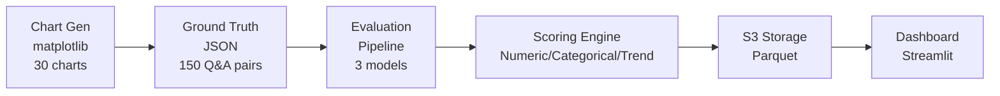

# LLM Business Chart Benchmark

A comprehensive evaluation framework for testing model performance on business chart interpretation tasks.

## Overview

This project evaluates three leading multimodal models (Claude Sonnet 4.5, GPT-5, and Gemini 2.5 Pro) on their ability to interpret business charts. The system generates **30 diverse business charts** across varying difficulty levels with ground truth answers, runs automated evaluations, and provides detailed analytics through an interactive Streamlit dashboard.

## Features

- **Chart Generation**: Creates 30 diverse business charts with realistic data
  - Progressive difficulty from basic to very hard
  - 150 total questions (5 per chart) testing vision and reasoning capabilities
- **Multi-Model Evaluation**: Tests Claude, GPT-5, and Gemini with identical prompts
- **Intelligent Scoring**: 
  - Numeric answers with configurable tolerance (default 3%)
  - Categorical matching with keyword detection
  - Special handling for negative numbers, correlations, and multi-format answers
- **Cost Tracking**: Real-time cost monitoring with per-model budget limits
- **Interactive Dashboard**: Streamlit-based visualization with model comparison, deep dive analysis, and insights
- **S3 Integration**: Cloud storage for results with automatic sync

## Chart Types (30 Total)

The benchmark includes a diverse range of chart types designed to test various aspects of model capabilities:

- **Basic Charts** (1-10): Line charts, bar charts, pie charts, funnels, scatter plots
- **Statistical Charts** (11-15): Heatmaps, box plots, waterfalls, log scales, Gantt charts
- **Advanced Charts** (16-20): Bubble charts, radar charts, stream graphs, dual-axis, complex correlations
- **Challenge Charts** (21-30): Forecast intervals, retention cohorts, anomaly detection, supply/demand dynamics, competitive analysis

Each chart includes:
- 3 Tier 1 (factual) questions - Direct data extraction
- 2 Tier 2 (pattern) questions - Reasoning, calculations, trend analysis

## Quick Start

### 1. Setup Environment

```bash
# Clone and navigate to project
cd chart-evaluation-dashboard

# Install dependencies
pip install -r requirements.txt

# Copy environment template
cp .env.example .env
# Edit .env with your API credentials
```

### 2. Configure API Credentials

Edit `.env` with your credentials:

- **AWS**: For Claude Sonnet 4.5 via Bedrock
- **OpenAI**: For GPT-5 API access  
- **Google Cloud**: For Gemini 2.5 Pro via Vertex AI

### 3. Generate Charts

```bash
python scripts/generate_charts.py
```

This creates 30 diverse business charts in `data/charts/` and ground truth in `data/ground_truth.json`.

**Expected output:**
```
Generating charts...
Creating chart_001...
Creating chart_002...
...
Creating chart_030...

Generated 30 charts in data/charts/
Ground truth saved to data/ground_truth.json
```

### 4. Run Evaluation

```bash
# Test API connectivity
python scripts/setup_apis.py

# Run full evaluation pipeline
python scripts/run_evaluation.py
```

> **Note:** With 30 charts × 5 questions × 3 models = 450 evaluations, expect:
> - **Runtime**: ~25-40 minutes
> - **Cost**: ~$4-8 depending on model usage
> - **Results**: Stored in `results/` and automatically synced to S3

### 5. Launch Dashboard

```bash
streamlit run dashboard/app.py
```

Access at http://localhost:8501

## Current Performance Results

With the updated 30-chart benchmark (150 questions):

| Model | Overall Accuracy |
|-------|-----------------|
| **Claude Sonnet 4.5** | 89.3% |
| **GPT-5** | 87.3% |
| **Gemini 2.5 Pro** | 75.3% |

The benchmark successfully differentiates model performance with:
- 3% tolerance on numeric answers
- 100% unit clarity (all questions specify expected units)
- Challenging Q5 questions testing advanced vision and reasoning

## Architecture



## Future Improvements

### Planned Enhancements
- **Very Hard Difficulty Tracking**: Add explicit `very_hard` difficulty field to better analyze model performance on the most challenging charts
- **Additional Models**: Expand evaluation to include:
  - Closed-source: GPT-5 Mini, Claude Opus 4.1
  - Open-source: Qwen family, DeepSeek, Llama family

### Potential Scaling
- Add domain-specific charts (healthcare, finance, manufacturing)
- Implement parallel processing for faster evaluation
- Add result caching for interrupted runs
- Create chart templates for easier expansion

## Evaluation Criteria

### Task 1: Factual Questions (90 questions)
- Direct data point extraction from charts
- Categorical identification and classification
- Reading values from axes, legends, and labels

### Task 2: Pattern Recognition (60 questions)
- Trend analysis and growth calculations
- Multi-step reasoning and aggregations
- Comparative analysis across data series
- Visual inference (slopes, correlations, distributions)

### Question Types
- **Numeric**: Answers with 3% tolerance by default (0.05 for correlations)
- **Categorical**: Keyword-based matching with stemming
- **Trend**: Special logic for detecting patterns and distributions

## Lessons Learned

### What Worked Well
- **Matplotlib for Chart Generation**: Provided precise control over data and labels
- **Streamlit Dashboard**: Fast iteration on UI and analytics
- **S3 Integration**: Reliable storage and easy sharing of results
- **Comprehensive Scoring**: Handled edge cases like negative numbers, multiple units, percentage distributions

### Challenges Encountered
- **AWS Bedrock Setup**: Initial configuration for Claude API access required understanding IAM roles and region availability
- **Google Cloud Vertex AI**: Gemini setup involved service account permissions and project configuration
- **API Consistency**: Each provider (AWS, OpenAI, Google) has different authentication and request formats
- **Edge Case Answers**: Models sometimes answer in exact numbers (e.g., 120,000) when chart is measured in thousands (answer should be 120)
- **Creating Challenging Questions**: Balancing difficulty while keeping questions fair and unambiguous required multiple iterations

### If I Were to Start Over
- **Use an AI SDK with OpenRouter**: Would have saved significant time on API integration
  - Single unified interface for all models
  - Simplified authentication
  - Easier to add new models
- **Implement Difficulty Tracking Earlier**: Would have tagged `very_hard` charts from the beginning for better analytics
- **Automated Test File Cleanup**: Create a utility to remove temporary test files automatically
- **Comprehensive Edge Case Testing**: Build a systematic test suite for answer format variations (units, decimals, ranges) before full evaluation
  - Test each question type with 5-10 edge case responses
  - Validate scoring logic handles all reasonable answer formats
  - Document expected behavior for ambiguous cases

## Technical Stack

- **Python 3.8+**: Core language
- **Matplotlib**: Chart generation
- **Pandas & NumPy**: Data manipulation
- **Streamlit**: Interactive dashboard
- **Plotly**: Dashboard visualizations
- **boto3**: AWS S3 integration
- **OpenAI, AWS Bedrock (Claude), Google Cloud**: Model APIs

## Project Structure

```
chart-evaluation-dashboard/
├── data/
│   ├── charts/              # Generated chart images (30 total)
│   └── ground_truth.json    # Questions and answers
├── dashboard/
│   ├── app.py              # Main Streamlit app
│   ├── utils.py            # Dashboard utilities
│   └── pages/              # Overview, Deep Dive, Insights
├── scripts/
│   ├── generate_charts.py  # Chart generation
│   ├── run_evaluation.py   # Evaluation pipeline
│   └── rescore_results.py  # Re-scoring utility
├── src/
│   ├── evaluation/         # Scoring logic
│   ├── models/            # Model API wrappers
│   └── storage/           # S3 handler
└── results/               # Evaluation results (Parquet)
```

## License

MIT License - see LICENSE file for details.
